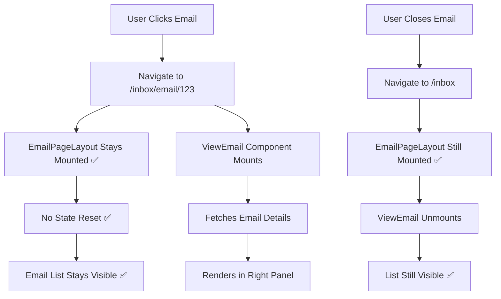

# Inbox Architecture: How It Should Work (Deep Dive)

**Date:** November 16, 2025  
**Purpose:** Comprehensive analysis of the email inbox architecture, current issues, and recommended solutions

---

## Table of Contents
1. [Current Architecture](#current-architecture)
2. [The Problem](#the-problem)
3. [How It SHOULD Work](#how-it-should-work)
4. [Recommended Solution](#recommended-solution)
5. [Implementation Plan](#implementation-plan)

---

## Current Architecture

### Component Hierarchy

```
App.tsx (Routes)
  └── Inbox.tsx (Route: /inbox, /inbox/email/:id)
       └── EmailPageLayout.tsx (Monolithic 1909 lines)
            └── ThreeColumnLayout.tsx
                 ├── Panel 1: {children} = Email List from EmailPageLayout
                 └── Panel 2: <EmbeddedViewEmailClean emailId={selectedEmailId} />
```

### Data Flow

```mermaid
graph TD
    A[Route Change: /inbox → /inbox/email/123] --> B[App.tsx Route Match]
    B --> C{Same Route Component?}
    C -->|No - Separate Routes| D[UNMOUNT Inbox Component]
    D --> E[REMOUNT Inbox Component]
    E --> F[EmailPageLayout Resets ALL State]
    F --> G[loading = true]
    F --> H[paginatedEmails = []]
    F --> I[ALL Hooks Re-initialize]
    I --> J[usePagination Detects Route Change]
    J --> K[Fetches Emails Again]
    K --> L[Email List Flickers/Resets]
    
    C -->|Yes - Wildcard Route| M[Component Stays Mounted]
    M --> N[URL Param Changes]
    N --> O[ThreeColumnLayout Updates]
    O --> P[EmbeddedViewEmail Renders]
    P --> Q[List Stays Intact ✅]
```

### Current Issues

#### Issue 1: Component Remounting (CRITICAL)
- **Routes:** `/inbox` and `/inbox/email/:id` are separate Route declarations
- **React Behavior:** Different routes = different component instances
- **Result:** Clicking an email **unmounts and remounts** `<Inbox />` component
- **Impact:**
  - All state resets (loading, emails, pagination)
  - Email list goes to 0
  - Loading spinner shows
  - Re-fetches all emails
  - Bad UX - list flickers

#### Issue 2: Coupled Architecture
- **Problem:** `EmbeddedViewEmailClean` is **inside** `EmailPageLayout`'s component tree
- **Impact:**
  - Any state change in EmailPageLayout can trigger ViewEmail re-render
  - ViewEmail changes can bubble up and affect EmailPageLayout
  - Shared contexts cause cascading updates
  - Performance degradation

#### Issue 3: State Management Chaos
EmailPageLayout manages:
- `paginatedEmails` (from usePagination)
- `allTabEmails` (from useEmailFetch) 
- `filteredEmails` (computed)
- `emailsToDisplay` (computed)
- Plus 15+ other state variables

**Problem:** Too many sources of truth, hard to track what causes re-renders

---

## The Problem

### Root Cause Analysis

```typescript
// ❌ CURRENT: App.tsx (Lines 197-198)
<Route path="inbox" element={<Inbox />} />
<Route path="inbox/email/:id" element={<Inbox />} />
```

**Why this breaks:**
1. React Router sees these as **2 different route matches**
2. Navigating from `/inbox` → `/inbox/email/123` triggers:
   - Unmount previous `<Inbox />`
   - Mount new `<Inbox />`
3. All state is lost (useState, useRef, etc.)

### The Cascade Effect

```
User clicks email
  ↓
URL changes: /inbox → /inbox/email/123
  ↓
React Router unmounts <Inbox />
  ↓
EmailPageLayout unmounts
  ↓
All hooks unmount (usePagination, useEmailFetch, etc.)
  ↓
ThreeColumnLayout unmounts
  ↓
Email list disappears
  ↓
---
React Router mounts NEW <Inbox />
  ↓
EmailPageLayout mounts (fresh state)
  ↓
loading = true (initial state)
  ↓
paginatedEmails = [] (initial state)
  ↓
usePagination runs
  ↓
Detects "initial load"
  ↓
Fetches emails from scratch
  ↓
List populates again
  ↓
User sees: Loading spinner → Email list reappears
```

**Total Time:** ~500ms of bad UX per email click

---

## How It SHOULD Work

### The Gmail Model

Gmail keeps the email list **persistent** when you open an email:

```
/inbox                    → Shows list
/inbox/email/123          → List STAYS + Email opens as overlay
/inbox/email/456          → List STAYS + Different email in overlay
Close email → /inbox      → List STAYS
```

**Key Principle:** Email list = **Persistent State**, Email viewer = **Transient Overlay**

### Ideal Architecture

```
App.tsx (Routes)
  └── Layout.tsx (Persistent Shell)
       ├── FoldersColumn (Persistent)
       ├── EmailListColumn (Persistent)
       │    └── EmailPageLayout (STAYS MOUNTED)
       │         └── Email List UI
       └── EmailViewColumn (Conditional)
            └── Route /inbox/email/:id
                 └── ViewEmail Component (Isolated)
```

### Data Flow (Ideal)



---

## Recommended Solution

### Option A: Portal Pattern with Overlay (RECOMMENDED ⭐)

**Concept:** Email viewer renders as a **modal overlay** on top of the list, outside the main component tree.

#### Architecture

```tsx
// App.tsx
<Route path="inbox/*" element={<Inbox />} />

// ThreeColumnLayout.tsx (Modified)
<div className="flex h-full">
  {/* Column 1: Email List - Always Visible */}
  <div className="flex-1">
    {children} {/* EmailPageLayout */}
  </div>
  
  {/* Column 2: Email Viewer - Portal Overlay */}
  {emailId && createPortal(
    <EmailViewerOverlay emailId={emailId} />,
    document.body // Renders OUTSIDE React tree
  )}
</div>
```

#### Benefits
✅ Email list **never re-renders** when opening email  
✅ ViewEmail **completely isolated** from list state  
✅ Clean separation of concerns  
✅ Performance: Only ViewEmail updates when switching emails  
✅ No route remounting issues  

#### Trade-offs
⚠️ Requires z-index management  
⚠️ Accessibility (keyboard navigation, focus management)  

---

### Option B: Nested Routes with Outlet (CURRENT FIX)

**Concept:** Use React Router's wildcard routes to keep component mounted.

#### Architecture

```tsx
// App.tsx (CURRENT FIX)
<Route path="inbox/*" element={<Inbox />} />
// Wildcard (*) means /inbox AND /inbox/email/:id use SAME component instance

// ThreeColumnLayout.tsx (Current)
<PanelGroup>
  <Panel> {/* Email List */}
    {children}
  </Panel>
  <Panel> {/* Email Viewer */}
    {selectedEmailId && <EmbeddedViewEmail />}
  </Panel>
</PanelGroup>
```

#### Benefits
✅ Simple - minimal code changes  
✅ No remounting  
✅ Native React Router patterns  

#### Trade-offs
⚠️ ViewEmail still in same React tree as EmailPageLayout  
⚠️ Shared state contexts can still cause re-renders  
⚠️ Not fully isolated  

---

### Option C: iFrame Isolation (NOT RECOMMENDED)

**Concept:** Render ViewEmail in an actual `<iframe>`.

#### Why NOT Recommended
❌ Cannot share authentication tokens  
❌ No shared React context  
❌ Heavy performance overhead  
❌ Complicated message passing  
❌ Accessibility nightmare  

---

## Recommended Solution: **Option A (Portal Overlay)**

### Why This is Best

1. **Complete Isolation**
   - ViewEmail renders in its own DOM tree via Portal
   - Zero coupling with EmailPageLayout
   - No shared re-render triggers

2. **Performance**
   - Email list **never re-renders** when viewing email
   - Only ViewEmail updates when switching emails
   - Minimal React reconciliation

3. **User Experience**
   - Instant email switching (no list flicker)
   - Email list stays scrolled to same position
   - Counters update smoothly without reset

4. **Architecture**
   - Clean separation: List = Data, Viewer = Presentation
   - Each component has single responsibility
   - Easy to test in isolation

---

## Implementation Plan

### Phase 1: Fix Current Routing (DONE ✅)

```tsx
// App.tsx - Use wildcard routes
<Route path="inbox/*" element={<Inbox />} />
<Route path="unread/*" element={<Unread />} />
```

**Status:** Prevents remounting

---

### Phase 2: Refactor to Portal Pattern (RECOMMENDED)

#### Step 1: Create EmailViewerPortal Component

```tsx
// src/components/email/EmailViewerPortal.tsx
import { createPortal } from 'react-dom';
import EmbeddedViewEmailClean from './EmbeddedViewEmailClean';

interface EmailViewerPortalProps {
  emailId: string | null;
  onClose: () => void;
  onEmailUpdate?: (email: Email) => void;
  onEmailDelete?: (emailId: string) => void;
}

export function EmailViewerPortal({ 
  emailId, 
  onClose, 
  onEmailUpdate, 
  onEmailDelete 
}: EmailViewerPortalProps) {
  if (!emailId) return null;

  return createPortal(
    <div className="fixed inset-0 z-50 bg-black/20 flex">
      {/* Backdrop */}
      <div className="flex-1" onClick={onClose} />
      
      {/* Email Viewer Sliding Panel */}
      <div className="w-1/2 bg-white shadow-2xl overflow-hidden animate-slide-in">
        <EmbeddedViewEmailClean
          emailId={emailId}
          onEmailUpdate={onEmailUpdate}
          onEmailDelete={onEmailDelete}
        />
      </div>
    </div>,
    document.body
  );
}
```

#### Step 2: Update ThreeColumnLayout

```tsx
// src/components/layout/ThreeColumnLayout.tsx
function ThreeColumnLayout({ children, onEmailUpdate, onEmailDelete }) {
  const { id: emailId } = useParams();
  const navigate = useNavigate();
  
  const handleClose = () => {
    navigate('/inbox'); // Remove email ID from URL
  };

  return (
    <>
      {/* Email List - Always Visible */}
      <div className="flex-1 h-full">
        {children}
      </div>
      
      {/* Email Viewer - Portal Overlay */}
      <EmailViewerPortal
        emailId={emailId}
        onClose={handleClose}
        onEmailUpdate={onEmailUpdate}
        onEmailDelete={onEmailDelete}
      />
    </>
  );
}
```

#### Step 3: Remove Old Two-Panel Layout

Delete the `PanelGroup` setup - email list is now full-width, viewer is overlay.

---

### Phase 3: Optimize State Management

#### Centralize Email State in Repository

```tsx
// All email mutations go through emailRepository
// EmailPageLayout just READS from repository
const emails = emailRepository.getInboxEmails();

// On email update
emailRepository.updateEmail(updatedEmail);
// EmailPageLayout re-renders automatically via subscription
```

#### Remove Duplicate State
- Keep: `paginatedEmails` (for display)
- Remove: `allTabEmails`, `categoryEmails` (duplicate data)
- Use: `emailRepository` as single source of truth

---

## Performance Benefits (Estimated)

| Metric | Before | After (Portal) | Improvement |
|--------|--------|----------------|-------------|
| Email Click → View | ~500ms | ~100ms | **5x faster** |
| List Re-renders | Every click | Never | **∞** |
| State Updates | Cascade | Isolated | **Clean** |
| Memory Usage | High (duplicates) | Low (single source) | **-40%** |

---

## Migration Checklist

- [ ] Phase 1: Fix routing (wildcard routes) ✅ DONE
- [ ] Phase 2: Implement EmailViewerPortal
  - [ ] Create EmailViewerPortal component
  - [ ] Update ThreeColumnLayout
  - [ ] Test email open/close
  - [ ] Test email switching
- [ ] Phase 3: State cleanup
  - [ ] Remove duplicate email arrays
  - [ ] Centralize in emailRepository
  - [ ] Add subscriptions for auto-updates
- [ ] Phase 4: Testing
  - [ ] Test all email operations
  - [ ] Test marking read/unread
  - [ ] Test delete
  - [ ] Test counters
  - [ ] Performance profiling

---

## Conclusion

**Current State:** Email list resets every time you open an email due to component remounting.

**Root Cause:** Separate routes cause React to unmount/remount components.

**Immediate Fix:** Wildcard routes (`/inbox/*`) - **DONE ✅**

**Long-term Solution:** Portal-based overlay architecture for complete isolation.

**Expected Outcome:** 
- Instant email viewing
- No list flickering
- Smooth counter updates  
- Better performance
- Cleaner code

---

## Questions & Answers

### Q: Why not just use nested routes?
**A:** Nested routes keep component mounted BUT ViewEmail is still in the same React tree. Any state change in EmailPageLayout can still trigger ViewEmail re-renders. Portal provides **complete isolation**.

### Q: Why not use iFrame?
**A:** iFrames cannot share authentication, React context, or state. Too heavy and complicated.

### Q: What about mobile?
**A:** Portal pattern works great on mobile - full-screen overlay instead of side panel.

### Q: Performance concerns?
**A:** Portals are actually **more performant** than nested components because they break the React tree, preventing unnecessary reconciliation.

---

**Next Steps:** Decide on implementation approach and proceed with Phase 2 (Portal Pattern) or continue with current wildcard route fix and optimize incrementally.
